# ChessMind

ChessMind - это веб-платформа для игры и обучения шахматам. Идея проекта простая: после партии игроку недостаточно увидеть только слово `Blunder`. Ему нужно понять, почему ход был плохим, что он пропустил и какой план стоит запомнить.

Я начал с обычной шахматной доски, но постепенно превратил проект в более цельный продукт: игра против AI, сохранение партий, replay, Stockfish-анализ, AI-коуч, онлайн-матч с другом по ссылке, пазлы, профиль, рейтинг, лидерборд и задел под Pro-монетизацию.

Проект сделан как MVP настоящего chess-learning сервиса, а не как учебная доска 8x8.

## Ссылки

| Что                        | Ссылка                             |
| ----------------------------- | ---------------------------------------- |
| Live demo                     | `https://chessmind-eta.vercel.app`     |
| GitHub                        | `https://github.com/berikbp/chessmind` |
| Демо Pro-промокод | `qwerty123`                            |

## Что я хотел показать этим проектом

В задании было важно не просто повторить существующие шахматные сайты, а показать продуктовый подход. Поэтому я сфокусировался не на одной фиче, а на полном цикле пользователя:

1. Игрок заходит и выбирает режим.
2. Играет партию против AI или друга.
3. Партия сохраняется в профиль.
4. Игрок может пересмотреть её без лишнего шума.
5. Затем он запускает Stockfish-анализ.
6. После этого AI-коуч объясняет ключевые моменты человеческим языком.
7. Если хочется тренироваться дальше, есть пазлы и дневные лимиты.

Самая важная часть для меня - связка `Stockfish + AI Coach`. Stockfish силён в точности, но не всегда понятен новичку. AI-коуч не заменяет движок, а переводит его вывод в понятные уроки: что было упущено, почему позиция ухудшилась и какой план стоило искать.

## Визуальный обзор

### Лобби и выбор режима

Лобби показывает, что проект устроен как продукт: есть профиль, рейтинг, быстрый старт и несколько режимов. Я специально ушёл от типичного "AI-generated" фиолетово-синего интерфейса и сделал более тёплый шахматный стиль, ближе к привычным игровым продуктам.

<p align="center">
  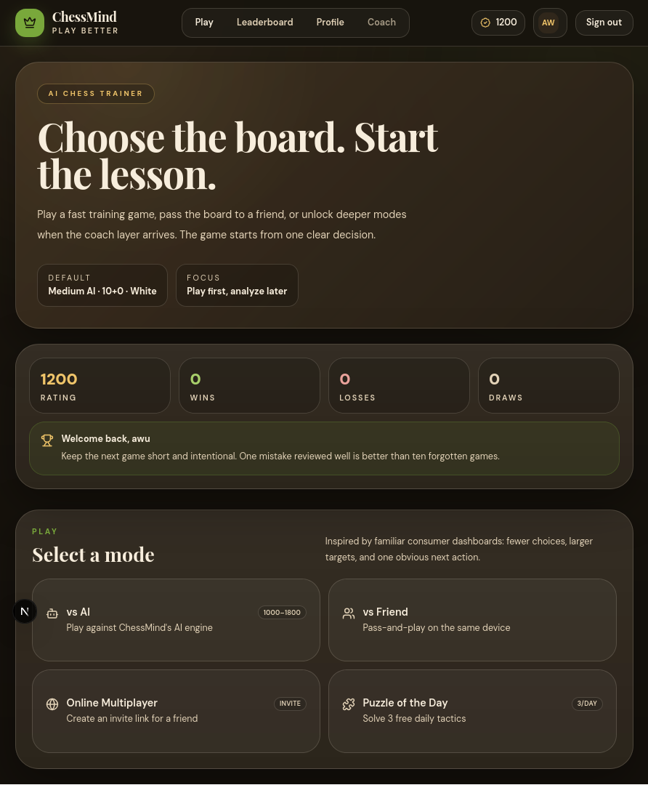
</p>

Перед партией игрок выбирает сложность AI, контроль времени и цвет. Эти настройки сохраняются в URL, чтобы режим был воспроизводимым и понятным.

<p align="center">
  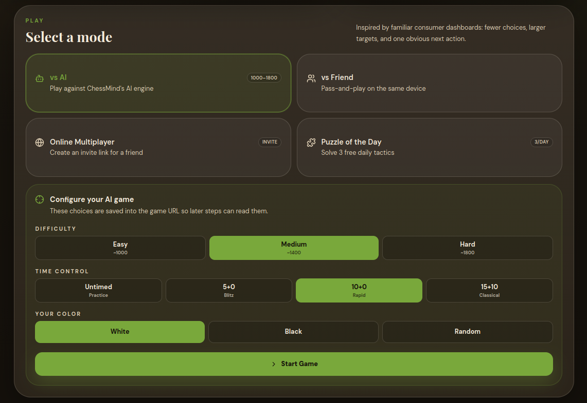
</p>

### Игровая доска

Я много работал над стабильностью доски. В шахматах очень раздражает, когда интерфейс прыгает после хода или на половине экрана уезжает к истории ходов. Поэтому доска, таймеры, съеденные фигуры и карточки игроков зафиксированы так, чтобы сама партия оставалась главным объектом внимания.

<p align="center">
  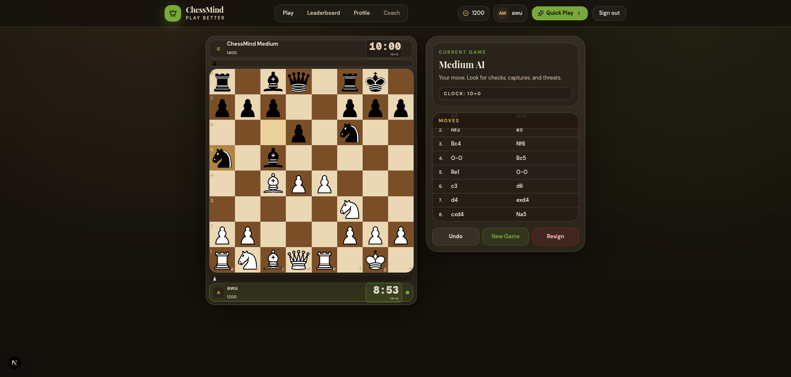
</p>

### Разбор партии

После партии можно запустить Stockfish review. Он проходит по партии, классифицирует ходы и строит график оценки. Это уже не просто сохранённая PGN-строка, а полноценный разбор.

**Старт анализа**

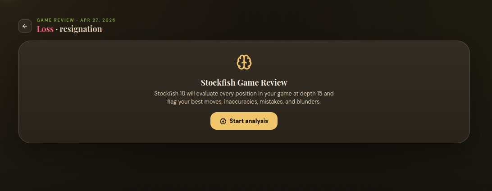

**Stockfish + AI Coach**

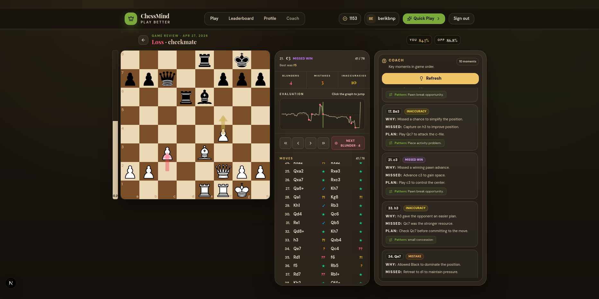

Важная деталь: AI-коуч не придумывает оценку сам. Источником истины остаётся Stockfish. OpenAI используется для объяснения выбранных движком моментов более понятным языком.

### Онлайн-матч по ссылке

Я добавил MVP-мультиплеер: один игрок создаёт invite-ссылку, второй заходит по ней, и партия синхронизируется через Supabase Realtime. Если realtime задерживается, есть polling fallback, чтобы игра не ломалась из-за сетевого состояния.

**Живая онлайн-игра**

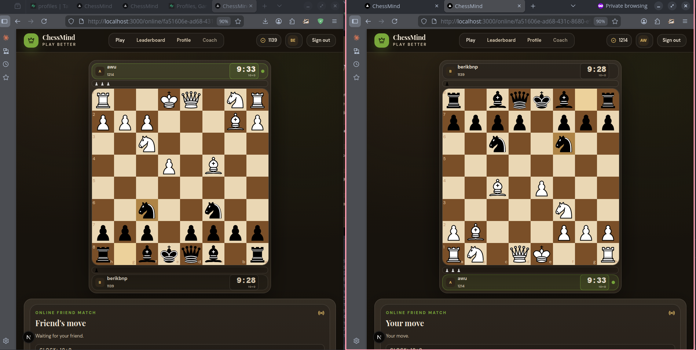

**Завершение партии**

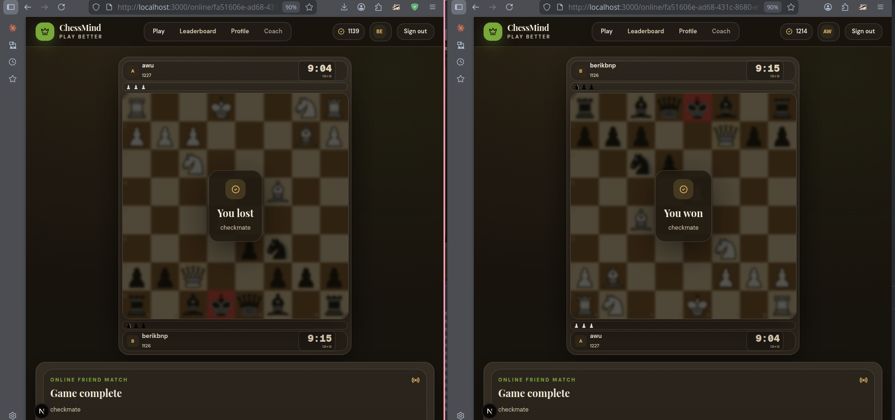

### Пазлы и лимиты

Пазлы сделаны как ещё один retention-механизм. Бесплатный пользователь получает ограниченное число стартов в день, Pro-пользователь - безлимит. Перед стартом есть отдельное окно, чтобы было понятно, когда именно тратится попытка.

**Стартовое окно**

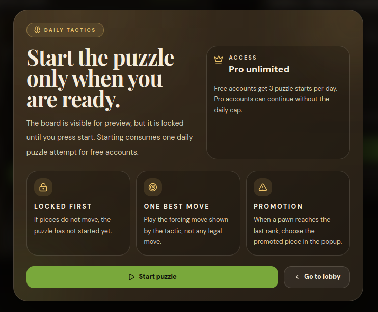

**Решённый пазл**

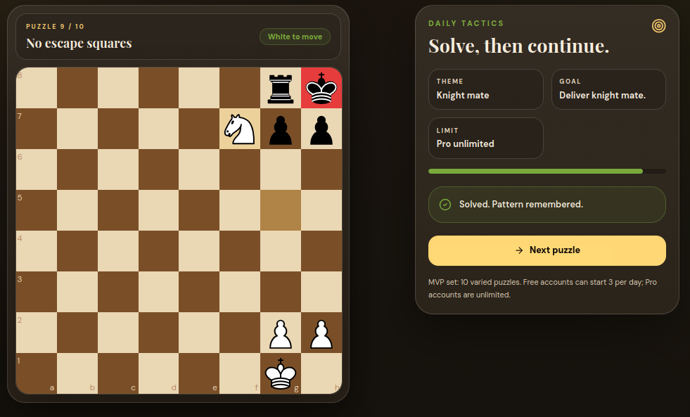

**Конец MVP-набора**

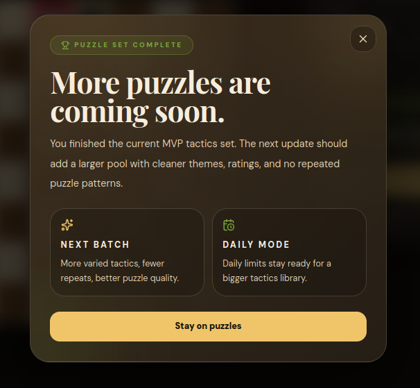

### Профиль и Pro-направление

Профиль хранит рейтинг, победы, поражения, win rate, город и последние партии. Последние партии открываются сначала как чистый replay, а не сразу как перегруженный анализ. Это сделано намеренно: иногда игрок хочет просто пересмотреть партию, а не сразу читать оценки движка.

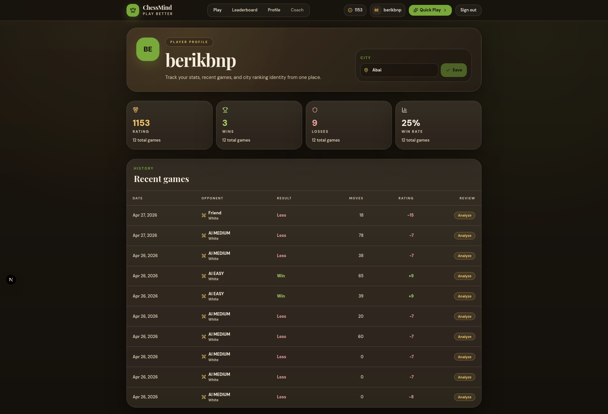

Pro-модалка пока не подключена к Stripe, но показывает бизнес-направление: дневные лимиты, unlock через промокод и будущая подписка.

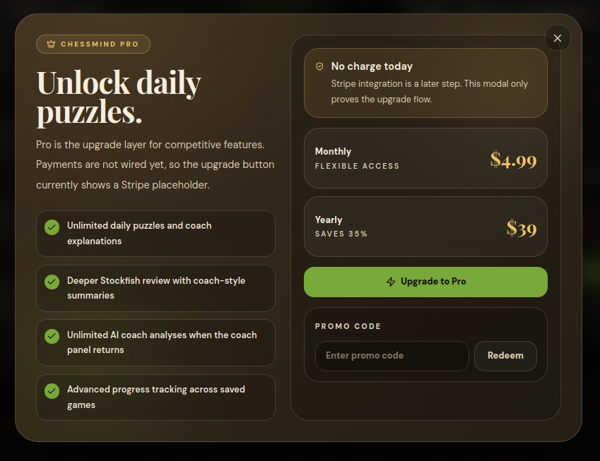

## Реализованный функционал

### Шахматная логика

- Полная проверка легальных ходов через `chess.js`.
- Рокировка, взятие на проходе, превращение пешки, шах, мат, пат и ничейные состояния.
- Drag-and-drop и click-to-move.
- Promotion dialog в обычной игре, онлайн-игре и пазлах.
- Стабильная доска с таймерами и съеденными фигурами.

### Игра против AI

- Easy AI работает через локальный minimax с alpha-beta pruning.
- Medium и Hard используют Stockfish 18 Lite WASM.
- Stockfish запускается в Web Worker, чтобы не блокировать интерфейс.
- Перед партией можно выбрать сложность, цвет и контроль времени.

### Сохранение партий

- Supabase Auth используется для аккаунтов.
- Партии сохраняются в Supabase с PGN, результатом, рейтингами до/после и количеством ходов.
- Профиль показывает историю партий.
- Каждая партия открывается в replay-режиме, а затем может быть отправлена на анализ.

### Stockfish review

- Разбор всей партии по ходам.
- Классификации: `Best`, `Good`, `Inaccuracy`, `Mistake`, `Blunder`, `Missed Win`.
- Eval graph и eval bar.
- Навигация по ходам.
- Подсчёт accuracy.
- Отдельная панель с ключевыми моментами.

### AI Coach

- OpenAI API объясняет выбранные review-моменты.
- Формат объяснения: почему ход не сработал, что было упущено, какой план был лучше.
- AI-ответы нормализуются: если модель пропускает момент или возвращает неидеальный JSON, backend подставляет fallback на основе Stockfish-данных.
- Для бесплатных пользователей есть дневной лимит, для Pro - безлимит.

### Онлайн-мультиплеер

- Создание invite-ссылки.
- Join flow для второго пользователя.
- Синхронизация через Supabase Realtime.
- Polling fallback, если realtime не успел обновиться.
- Состояния ожидания, хода игрока, завершения партии.
- Сдача партии, сохранение результата, ссылка на review.
- Rematch после завершения игры.

### Пазлы

- Локальный MVP-набор тактических задач.
- Стартовое окно с объяснением правил.
- Дневной лимит для free-аккаунтов.
- Pro unlock через промокод.
- Проверка forcing move, ответ соперника, переход к следующему пазлу.
- Поддержка promotion.
- Экран "more puzzles coming soon" после прохождения набора.

### Профиль, рейтинг и лидерборд

- Профиль игрока с username, city, rating, wins, losses, win rate.
- Recent games с переходом в replay или review.
- Leaderboard с глобальным и городским направлением.
- Рейтинги обновляются после партий.

### Monetization direction

- Pro-модалка.
- Promo code flow.
- Демо-промокод: `qwerty123`.
- Дневные лимиты для пазлов и AI-коуча.
- Stripe не подключён, но продуктовая точка входа под монетизацию уже есть.

## Самые сложные части

### 1. Стабильная доска

Сначала интерфейс вёл себя плохо на половине экрана: доска могла смещаться, таймеры занимали слишком много места, история ходов уводила фокус. Я переработал layout так, чтобы доска оставалась главным и стабильным элементом. Это маленькая UX-деталь, но в шахматном интерфейсе она критична.

### 2. Stockfish в браузере

Stockfish 18 Lite работает через WASM и Web Worker. Это позволило сделать анализ и AI-ходы без отдельного chess-engine сервера. Основная сложность была не просто запустить Stockfish, а встроить его в пользовательский flow: игра, сохранение, review, график, классификация ходов.

### 3. Realtime multiplayer

Онлайн-игра работает через Supabase Realtime, но я добавил polling fallback, потому что realtime в реальном мире может задерживаться или переподключаться. Такой подход делает MVP устойчивее: даже если realtime-событие не пришло мгновенно, клиент всё равно синхронизируется.

### 4. AI Coach как слой поверх Stockfish

Я не хотел, чтобы AI просто "фантазировал" про шахматы. Поэтому AI получает уже выбранные Stockfish-моменты и объясняет их. Backend проверяет и нормализует ответ, чтобы пользователь не видел ошибку только из-за того, что модель вернула меньше объяснений, чем ожидалось.

## Технический стек

| Часть                        | Технологии                |
| --------------------------------- | ----------------------------------- |
| Framework                         | Next.js 16 App Router               |
| UI                                | React 19, Tailwind CSS 4            |
| Язык                          | TypeScript                          |
| Шахматные правила | chess.js                            |
| Доска                        | react-chessboard                    |
| Engine                            | Stockfish 18 Lite WASM              |
| AI Coach                          | OpenAI API                          |
| Backend logic                     | Next.js Route Handlers на Node.js |
| Auth / DB / Realtime              | Supabase                            |
| Графики                    | Recharts                            |
| Icons                             | lucide-react                        |
| Deploy                            | Vercel                              |

## Архитектура

Проект находится в корне репозитория:

```text
src/app                App Router страницы и API routes
src/components         UI-компоненты
src/hooks              Игровая логика, таймеры, Stockfish hooks
src/lib/chess          Анализ, minimax, пазлы, board styles
src/lib/supabase       Browser/server/admin Supabase clients
src/lib/usage          Daily limits для пазлов и coach review
supabase               SQL setup scripts
public                 Stockfish worker/WASM и статические файлы
docs/screenshots       Скриншоты для README
```

Backend находится внутри Next.js:

- `src/app/api/coach/route.ts` - AI coach endpoint.
- `src/app/api/game/save/route.ts` - сохранение партий.
- `src/app/api/online-games/*` - создание, join, sync и completion онлайн-игр.
- `src/app/api/usage/*` - дневные лимиты.
- `src/app/api/pro/redeem/route.ts` - промокод Pro.

## Соответствие требованиям задания

| Уровень | Что реализовано                                                                                                                                      |
| -------------- | ------------------------------------------------------------------------------------------------------------------------------------------------------------------ |
| Слабый   | Превышено: есть не статическая доска, а полноценная шахматная логика.                                    |
| Средний | Полные правила, нормальный React/Next.js проект, игра на одной доске.                                                 |
| Сильный | AI-противник, история партий, авторизация, Supabase, сохранение прогресса, профиль.                     |
| Великий | Invite multiplayer, AI Coach, лидерборд/социальный слой, Pro-направление, daily limits, продуктовая упаковка. |

## Как запустить локально

```bash
npm install
npm run dev
```

Открыть:

```text
http://localhost:3000
```

## Environment variables

Для локального запуска нужен `.env.local`:

```bash
NEXT_PUBLIC_SUPABASE_URL=your_supabase_project_url
NEXT_PUBLIC_SUPABASE_ANON_KEY=your_supabase_anon_key
SUPABASE_SERVICE_ROLE_KEY=your_supabase_service_role_key
OPENAI_API_KEY=your_openai_key
```

## Supabase setup

В Supabase нужно выполнить SQL-файлы:

```text
supabase/fix_handle_new_user.sql
supabase/step20_daily_usage.sql
supabase/step22_online_games.sql
```

Если PostgREST не видит таблицы сразу после создания:

```sql
notify pgrst, 'reload schema';
```

Для демо email confirmation отключён намеренно: стандартный email sender Supabase быстро упирается в лимиты, а судьям важно иметь возможность быстро зарегистрироваться и проверить продукт.

## Что ещё можно улучшить

Проект уже работает как MVP, но я вижу несколько следующих шагов:

- Подключить Stripe вместо demo promo code.
- Расширить базу пазлов и добавить рейтинг задач.
- Добавить random matchmaking поверх текущего invite multiplayer.
- Улучшить мобильную версию и добавить отдельный mobile screenshot в README.
- Сделать более глубокую память AI-коуча: повторяющиеся ошибки игрока, персональные темы, недельный прогресс.
- Настроить custom SMTP для production auth.

## Почему я считаю проект сильным

В ChessMind я показал не одну изолированную фичу, а несколько связанных систем: шахматные правила, engine-анализ, AI-объяснения, realtime, auth, база данных, UX-итерации, ограничения free/pro и деплой-ready структуру.

Главное, что я здесь сделал - превратил обычную шахматную доску в продуктовый цикл обучения. Игрок не просто делает ход. Он играет, сохраняет партию, возвращается к ней, видит оценку движка и получает объяснение, которое можно запомнить. Для меня это и есть разница между "шахматным сайтом" и сервисом, к которому хочется вернуться.
